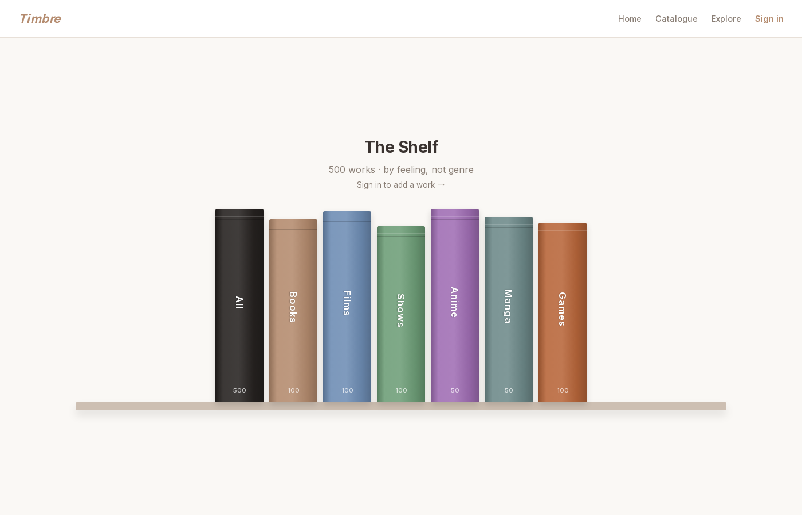

# Timbre

Timbre finds books, films, shows, anime, manga and games by how they make you feel. It's live at **[timbre.alexwoodka.com](https://timbre.alexwoodka.com)**, where anyone can browse the catalogue, explore the map, compose a mood and run three free-text searches a day. Rating things and getting recommendations for you need a free account.

Most recommendation engines sort by genre, so liking one space opera gets you nine more space operas, whether or not any of them feel like the one you liked. I wanted something that could tell me which game hits the way a particular novel did.

The idea is that what you're after when you love something is mostly how it made you feel, and that carries across mediums. So Timbre scores every work on the same set of feelings and puts them all in one shared space, where "what feels like this?" becomes a nearest-neighbor search. Some of what that turns up in the current catalogue:

- Outer Wilds' closest book is Piranesi (0.75 cosine similarity), and Piranesi's closest game is Hollow Knight (0.82).
- Stardew Valley sits right next to the Barakamon anime (0.92) and Ted Lasso (0.86).
- Cormac McCarthy's novel The Road comes out closer to No Country for Old Men (0.77) than to its own film adaptation (0.66).
- The Great Gatsby and Baz Luhrmann's film of it have almost nothing in common (−0.09). The film scores high on joy, frenetic energy and sensuality, while the book is mostly melancholy with a bleak ending.



## How it works

Every work goes through Gemini 2.5 Flash twice. The first call writes a two-paragraph profile of its emotional signature and arc. The second reads that profile and scores the work from 0 to 1 on 31 dimensions: 25 felt emotions (isolation, wonder, dread, melancholy, warmth, nostalgia, grief, hope, stillness and so on) and 6 structural ones for the shape of the experience (pacing, emotional complexity, predictability, catharsis, emotional trajectory, and how the ending lands).

Those scores become a 31-dimensional vector, the work's emotional fingerprint, and similarity is the cosine between two vectors, computed in Postgres with pgvector. Before normalizing, each vector has the catalogue's average subtracted from it. That step matters because the catalogue leans dark. The highest averages are tension (0.62) and dread (0.59), the lowest are sensuality (0.13) and serenity (0.15), and without centering, works mostly matched on the heaviness they all share. Since the average moves whenever a work is added, adding one re-centers the whole catalogue.

Recommendations for you come from your ratings. When you rate something, you mark how strongly each of its top six emotions landed for you, from −2 to +2, and you can add stars if you want. After four ratings, Timbre turns those marks into a weight vector and ranks the catalogue against it. It also runs k-means over the works you loved, and if they split cleanly into groups (a silhouette score of at least 0.5), it treats them as up to three separate modes. That way a quiet, melancholy streak and a taste for thrillers each get their own row on your For You page instead of being averaged into one. Each row is spread out with maximal marginal relevance (MMR), which trades a little similarity for variety, so it isn't twelve versions of the same thing.

## What you can do with it

- Rate things by how they made you feel. Your For You page then has a row per mode, plus preset rows for comfort, awe, a thrill, something tender, uplifting endings and a good cry.
- Describe a feeling in plain words, like "something tense and lonely that ends on a little bit of hope." Gemini turns that into emotions to seek and avoid, an ending tone and an optional medium, and Timbre searches with those. The model never picks titles itself.
- Compose a mood by hand. Tap feelings to seek or avoid them, choose how you want it to end, and press Find it.
- Ask why something was recommended. Gemini writes a short note based on the rated works closest to it in feeling. Notes are cached, and you can regenerate one.
- Explore the catalogue as a 3D map. The axes are distressing to pleasant, calm to intense and intimate to epic, you can swap any of them for a single emotion, and a marker shows where your taste sits.
- See your own fingerprint on the Your Taste page: the emotions you're drawn to, the ones you steer around, and how you like things to end.
- Add a work that isn't in the catalogue yet. Timbre looks it up, pulls metadata and a cover, and scores it in the background.

## Where it is

This is a working prototype. I'm building it to the point where I can hand it to friends and have it feel real. The catalogue is 500 works I picked by hand: 100 each of books, films, shows and games, and 50 each of anime and manga. Music is what I most want to add next, since a song has no plot to lean on and would be the cleanest test of the idea.

Accounts are free, but every new work, explanation and described-feeling search is a Gemini call I pay for. So each account gets a daily allowance (5 new works, 20 explanations and 30 searches), and there's a site-wide cap on top of that.

Each fingerprint is one model's reading of a work, so the scores are interpretations. The web context I meant to give the model also mostly didn't arrive. The scraper was supposed to find critical essays and Reddit threads about each work, but 390 of the 500 works got no essays, none got Reddit threads, and a lot of what it did find was off target (dictionary and grammar sites, streaming pages). So most fingerprints rest on what Gemini already knows about the work plus basic metadata.

The profiles are also cut short on purpose. When I tried limiting how long the profiles could be, the descriptions came out noticeably worse, so I let a token cap trim the long ones instead, betting that the dominant emotions come up first. The catch is that Gemini's hidden thinking counts against the same cap, so 207 of the 500 profiles stop mid-sentence, and most of those lose the two summary lines the prompt asks for at the end. The fix I have in mind is to give the thinking its own budget, ask for the summary lines first, and then regenerate and re-score the works that got cut off.

## Built with

The frontend is Next.js 14 (App Router, plain JSX) with Plotly for the 3D map and Recharts for the charts. The backend is FastAPI with async SQLAlchemy, and the database is Postgres 16 with pgvector. Gemini 2.5 Flash, through the google-genai SDK, does the scoring, the free-text search and the explanations. Metadata and covers come from Google Books and Open Library for books, TMDB for films and shows, RAWG for games, and Jikan (MyAnimeList) for anime and manga.

## Running it

Everything runs as one Docker Compose stack.

```bash
cp .env.example .env     # add GEMINI_API_KEY, TMDB_API_KEY and RAWG_API_KEY
make up                  # Postgres, the API and the web app, with hot reload
```

The backend won't start without a Gemini key. The TMDB and RAWG keys are only needed for film, show and game metadata; books, anime and manga don't need a key. `SECRET_KEY` and `COOKIE_SECURE` only matter for the production stack, and the daily allowances are defaults in `backend/app/config.py` (to override one without editing code, add it, e.g. `DAILY_NEW_WORKS_PER_USER`, to the backend's `environment` in the compose file, since the backend only sees the variables listed there). The app runs at http://localhost:3000, the API at http://localhost:8000 (with interactive docs at `/docs`), and Postgres on port 5432.

To load the starter catalogue, score it and fetch covers:

```bash
docker compose exec backend python -m seed --analyze
docker compose exec backend python -m backfill_covers
```

Scoring all 500 works means about 1,000 Gemini calls, made one work at a time.

`make rebuild` picks up dependency changes, `make logs` tails everything, `make ps` shows what's running, and `make down` stops the stack (the database volume stays). `make prod` brings up the hardened production stack, which is meant to sit behind a Cloudflare Tunnel.

The backend has a few maintenance scripts. `rescore.py` re-scores the catalogue after a prompt or dimension change and backs up the old scores first, `rebuild_embeddings.py` recomputes the centered vectors, and `eval_recommend.py` prints a report card on recommendation quality. The tests in `backend/tests` run against the seeded database and need at least 40 scored works. Most of them check the scores themselves (does Fleabag come out melancholy, do cozy games cluster), and 30 of the 419 fail against the current catalogue; they're there to show where the scoring falls short, so I haven't loosened them. pytest isn't in the image, so install it first:

```bash
docker compose exec backend sh -c "pip install pytest && python -m pytest"
```
